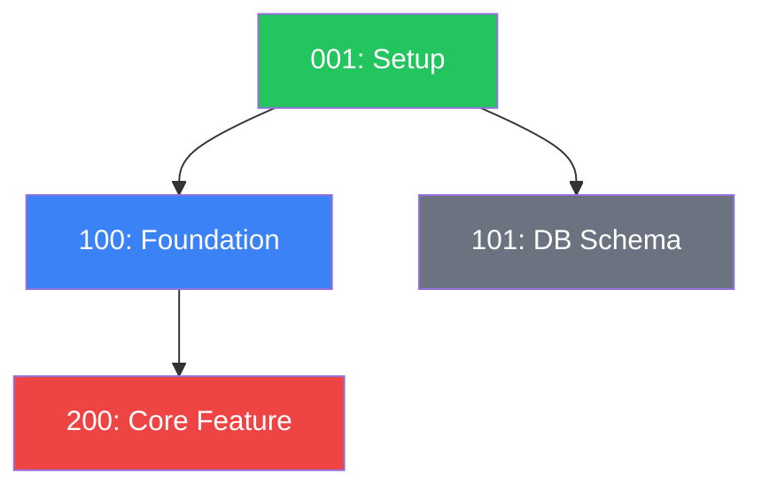

# galdr-dependency-graph

## Dispatcher Routing

This skill is the unified entry point for all dependency graph generation.

| Invocation | Behavior |
|------------|----------|
| `@g-dependency-graph` | Auto-detect from context: subsystem flow → subsystem graph; task flow or no context → task graph |
| `@g-dependency-graph --tasks` | Task graph only → `.galdr/DEPENDENCY_GRAPH.md` |
| `@g-dependency-graph --subsystems` | Subsystem graph only → `.galdr/SUBSYSTEM_GRAPH.md` (reads `g-skl-subsystem-graph`) |
| `@g-dependency-graph --all` | Both graphs in sequence |

**Context auto-detection rules:**
- If the triggering action involved `.galdr/subsystems/` files → route to `--subsystems`
- If the triggering action involved `.galdr/tasks/` files → route to `--tasks`
- If invoked directly with no flag → run `--tasks` (default, preserves existing behavior)
- If `--all` → run `--tasks` first, then `--subsystems`

For `--subsystems` or the subsystem branch of `--all`, read and follow [`g-skl-subsystem-graph`](./../g-skl-subsystem-graph/SKILL.md) in full.

---

## Task Dependency Graph

*The following sections apply when running in `--tasks` mode (the default).*

### When to Use
- After creating a task with `dependencies: [...]`
- After updating a task's `dependencies` field
- During `@g-cleanup` (Step 8)
- When user asks for "dependency graph", "task dependencies", "what blocks what"
- Explicit: `@g-dependency-graph --tasks`

### 1. Collect Task Data
Read all `.galdr/tasks/task*.md` files. For each, extract from YAML frontmatter:
- `id`
- `title`
- `status`
- `subsystem` (or `subsystems`)
- `priority`
- `dependencies` (array of task IDs)

### 2. Build Adjacency List
For each task with `dependencies: [A, B]`, create edges: `A --> current_task`, `B --> current_task`.

### 3. Compute Critical Path
Find the longest chain of dependent tasks from any root (no dependencies) to any leaf (nothing depends on it). This is the critical path — the minimum number of sequential tasks to project completion.

Algorithm:
1. Find all root tasks (dependencies empty or all dependencies completed)
2. BFS/DFS from each root, tracking path length
3. Longest path = critical path

### 4. Identify Blockers
Rank tasks by how many other tasks (transitively) depend on them. Top 3 = "Top Blockers".

### 5. Find Orphans
Tasks with no dependencies AND nothing depends on them. These can be done anytime.

### 6. Find Blocked Tasks
Tasks whose dependencies include at least one non-completed task.

### 7. Generate Mermaid Diagram


### 8. Write `.galdr/DEPENDENCY_GRAPH.md`

Use this format:

```markdown
# DEPENDENCY_GRAPH.md
<!-- AUTO-GENERATED — regenerated on task create/update with dependencies -->

**Generated**: {YYYY-MM-DD HH:MM UTC}
**Project**: {project_name}

---

## Critical Path

Longest dependency chain to project completion:

```
{task_id} -> {task_id} -> ... -> DONE
Estimated critical path length: {N} tasks
```

---

## Dependency Graph


---

## Top Blockers

| Rank | Task | Title | Unblocks | Status |
|------|------|-------|----------|--------|
| 1 | {id} | {title} | {n} tasks | {status} |

---

## Currently Blocked Tasks

| Task | Title | Waiting On | Status of Blocker |
|------|-------|------------|-------------------|
| {id} | {title} | Task {id} | {status} |

---

## Orphan Tasks

| Task | Title | Subsystem | Priority |
|------|-------|-----------|----------|
| {id} | {title} | {subsystem} | {priority} |

---

*Auto-regenerated on task dependency changes. Manual: `@g-dependency-graph --tasks`*
```

## Integration Points

This skill is triggered by:
1. **g-skl-tasks** — after creating a task with non-empty `dependencies`
2. **g-skl-tasks** — after updating a task's `dependencies` field
3. **g-skl-subsystems** — after adding/updating a subsystem with dependency changes (routes to `--subsystems`)
4. **g-skl-medic** — Phase 6 routine maintenance (runs `--all`)
5. **`@g-dependency-graph`** command — direct invocation with optional flags

The graph is always regenerated from scratch (not incrementally) to avoid drift.

