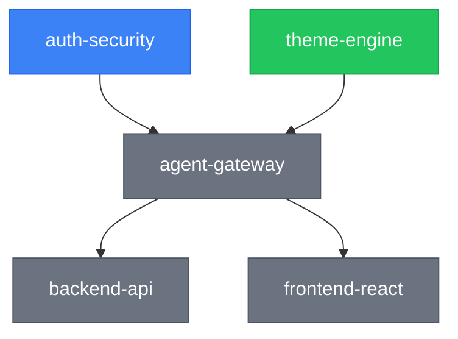

# gald3r-subsystem-graph

## When to Use
- After creating a subsystem with non-empty `dependencies` or `dependents`
- After updating a subsystem's `dependencies` or `dependents` fields in `g-skl-subsystems`
- During `@g-dependency-graph --subsystems` or `@g-dependency-graph --all`
- During `g-skl-medic` Phase 6 routine maintenance
- When user asks for "subsystem graph", "subsystem dependencies", "which subsystems depend on which"
- Explicit: `@g-subsystem-graph`

---

## Algorithm

### Step 1 — Collect Subsystem Data
Read all `.gald3r/subsystems/*.md` files. From each YAML frontmatter, extract:
- `name` (string, slug form)
- `status` (planned / active / stable / deprecated)
- `description` (short text)
- `dependencies` (array of subsystem name strings) — "this subsystem requires these"
- `dependents` (array of subsystem name strings) — "these subsystems require this one"

If a file has no `dependencies` or `dependents` keys, treat as empty arrays.

### Step 2 — Build Edge Set
Normalise edges from **both** directions for consistency (prefer `dependencies` as authoritative forward direction):

For each subsystem `S` with `dependencies: [A, B]`:
- Add edge: `A --> S` (A must exist before S)
- Add edge: `B --> S`

Cross-check `dependents`: for each subsystem `S` with `dependents: [X, Y]`:
- Add edge: `S --> X` and `S --> Y` if not already present
- Flag any contradictions between the two directions as a **data warning**

Build a final deduplicated edge list.

### Step 3 — Layer Analysis
Classify each subsystem node:

| Layer | Criterion |
|-------|-----------|
| **Root** | No incoming edges (nothing it depends on that is tracked) |
| **Core** | Has both incoming and outgoing edges AND is depended on by 3+ subsystems |
| **Mid-tier** | Has both incoming and outgoing edges, fewer than 3 dependents |
| **Leaf** | No outgoing edges (nothing depends on this one) |

### Step 4 — Cycle Detection
Perform a depth-first search on the directed graph. If any back-edge is found, record the cycle:

```
CYCLE DETECTED: A → B → C → A
```

List all cycles found. If none, write: `No circular dependencies detected.`

### Step 5 — Generate Mermaid Diagram
Use `graph TD` layout. Apply CSS classes for status:



Node label format: `subsystem-name` (use the slug name). Keep node IDs as slug names replacing `-` with `_` for Mermaid compatibility (e.g., `agent_gateway["agent-gateway"]`).

### Step 6 — Write `.gald3r/SUBSYSTEM_GRAPH.md`

```markdown
# SUBSYSTEM_GRAPH.md
<!-- AUTO-GENERATED — regenerated on subsystem create/update with dependencies -->

**Generated**: {YYYY-MM-DD HH:MM UTC}
**Project**: {project_name}
**Total subsystems**: {N} | **With deps**: {N} | **Isolated**: {N}

---

## Subsystem Dependency Graph


---

## Layer Analysis

### Root Subsystems (no inbound dependencies)
These can be implemented independently in any order.

| Subsystem | Status | Description |
|-----------|--------|-------------|
| {name} | {status} | {description} |

### Core Subsystems (most-depended-on)
These unblock the most other subsystems. Prioritize them.

| Subsystem | Status | Depended On By | Description |
|-----------|--------|----------------|-------------|
| {name} | {status} | {n} subsystems | {description} |

### Mid-Tier Subsystems
Have dependencies and are themselves depended on.

| Subsystem | Status | Depends On | Depended On By |
|-----------|--------|-----------|----------------|
| {name} | {status} | {list} | {list} |

### Leaf Subsystems (no dependents)
These are end-products; nothing else builds on them (yet).

| Subsystem | Status | Depends On | Description |
|-----------|--------|-----------|-------------|
| {name} | {status} | {list} | {description} |

### Isolated Subsystems (no deps in either direction)
No dependency data recorded. May need updating.

| Subsystem | Status | Description |
|-----------|--------|-------------|
| {name} | {status} | {description} |

---

## Status Summary

| Status | Count | Subsystems |
|--------|-------|-----------|
| active | {n} | {comma-list} |
| stable | {n} | {comma-list} |
| planned | {n} | {comma-list} |
| deprecated | {n} | {comma-list} |

---

## Cycle Detection

{Either "No circular dependencies detected." or list of cycles}

---

## Data Warnings

{Either "None." or list of contradictions between dependencies↔dependents fields}

---

*Auto-regenerated on subsystem dependency changes.*
*Manual: `@g-dependency-graph --subsystems` or `@g-subsystem-graph`*
```

---

## Integration Points

This skill is triggered by:
1. **g-skl-subsystems** — after adding/updating a subsystem with dependency changes (call explicitly after writing the subsystem file)
2. **g-skl-dependency-graph** — when invoked with `--subsystems` or `--all` flag (dispatcher delegates here)
3. **g-skl-medic** — Phase 6 routine maintenance
4. **`@g-subsystem-graph`** command — direct invocation

The graph is always regenerated from scratch (not incrementally) to avoid drift.

---

## Subsystem Frontmatter Reference

Expected frontmatter fields read by this skill:

```yaml
---
name: "subsystem-slug"          # required — slug used as graph node ID
status: planned                 # required — planned | active | stable | deprecated
description: "Short text"       # optional — shown in layer analysis tables
dependencies: ["name-a", "name-b"]   # optional — subsystems this one requires
dependents: ["name-x", "name-y"]     # optional — subsystems that require this one
---
```

Both `dependencies` and `dependents` are used to build the edge set. If a referenced name does not match any subsystem file, it is noted as an **unresolved reference** in Data Warnings.

