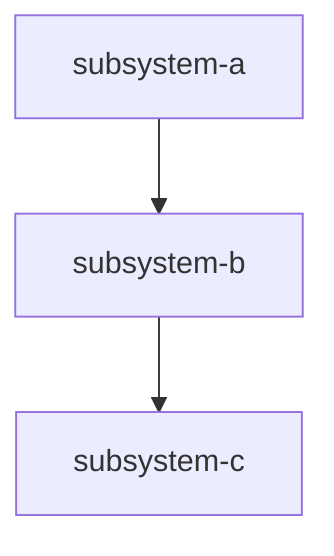

# g-subsystems

**Files Owned**: `.gald3r/SUBSYSTEMS.md`, `.gald3r/subsystems/**/*.md` (flat `name.md` or nested `domain/name.md`)

**Activate for**: "add subsystem", "g-subsystem-add", "update subsystem spec", "g-subsystem-upd", "deprecate subsystem", "g-subsystem-del", "what subsystems exist", "@g-subsystems", sync check for subsystem drift, before modifying any subsystem's code.

**Commands**: `@g-subsystem-add` (create), `@g-subsystem-upd` (update), `@g-subsystem-del` (deprecate), `@g-subsystems` (list/sync-check)

**Rule**: Read the subsystem spec BEFORE modifying subsystem code. Append to its Activity Log on task completion or bug fix.

---

## Operation: DISCOVER (used during g-setup)

Scan the project to identify subsystems:
- Top-level directories and `src/` subdirectories → candidate subsystems
- Database schema files → table groups suggest subsystems
- Config files → each config suggests a consuming subsystem
- API route files → each route group suggests a subsystem
- Docker services → each container is likely its own subsystem
- External service integrations → listed under their host subsystem

**Classify**:
- **Subsystem** — own code + state + lifecycle → top-level entry + spec file
- **Sub-feature** — shares parent's code/state → documented in parent spec (not its own entry)
- **Integration** — external adapter → listed in host subsystem spec

---

## Operation: CREATE SUBSYSTEM SPEC

**Naming Convention** (validate before creating):
- 2–6 hyphenated words
- Lead with a domain cluster prefix when applicable: `ai-agents-*`, `knowledge-vault-*`
- Describe *what it does or enables* — not just what it is
- Memorable and evocative for developers browsing the project
- Reads naturally as a bullet-point in a README feature list

**Bad**: `planning`, `ideas`, `commands`, `verification`, `hooks-system`  
**Good**: `project-planning-and-roadmaps`, `idea-white-board`, `command-library`, `adversarial-code-review`, `cross-platform-portable-history-logging`

Ask: *"Would a curious developer reading this name want to click into it?"*

If proposed name fails the convention → suggest a compliant alternative and wait for confirmation before creating.

Create `.gald3r/subsystems/{name}.md` (or nested `.gald3r/subsystems/<domain>/<name>.md` when using folder grouping). **Task frontmatter `subsystems:`** continues to use the logical `name:` value — nested folders do not change the identifier agents put in tasks.

```yaml
---
name: subsystem-name
status: active | planned | deprecated
min_tier: slim | full | adv
# Optional hierarchy (Task 515) — orthogonal to dependencies:
parent_subsystem: ''   # logical name of parent grouping (must exist when set)
domain: ''           # e.g. platform, harvest, adopted
layer: ''             # e.g. policy, transport, presentation
children: []          # logical child subsystem names (explicit; not inferred only from folders)
dependencies: [other-subsystem-names]
dependents: [subsystem-names-that-depend-on-this]
locations:
  code: [src/subsystem/]
  skills: [g-tasks, g-bugs]
  commands: [g-task-new]
  config: [config/subsystem.yaml]
  db_tables: [table_name]
---

# Subsystem: {name}

## Responsibility
[What this subsystem owns and does — 2-3 sentences]

## Data Flow
[How data enters and exits — inputs, outputs, events]

## Architecture Rules
- [What agents must never do when modifying this subsystem]
- [Patterns required or forbidden]

## When to Modify
[Trigger conditions that indicate work in this subsystem]

## Activity Log
| Date | Type | ID | Title | PRD |
|---|---|---|---|---|
| YYYY-MM-DD | TASK | NNN | {title} | PRD-NNN |
| YYYY-MM-DD | BUG | NNN | Fixed: {brief} | — |
```

**Add to SUBSYSTEMS.md** index and update the mermaid graph.

**Prompts during CREATE**:
- `min_tier:` — What is the minimum gald3r tier required to use this subsystem? (default: `slim`)
  - `slim` — No Docker, no API keys required; pure file-based skill
  - `full` — Requires API keys or network access (e.g., LLM API, GitHub API)
  - `adv` — Requires Docker backend, MCP server, or managed cloud service

---

## Operation: UPDATE ACTIVITY LOG

After any task completion or bug fix:
1. Read the task/bug's `subsystems:` field
2. For each subsystem, read `.gald3r/subsystems/{name}.md`
3. Append row to Activity Log table

---

## Operation: SYNC CHECK (staleness audit)

Collect all unique `subsystems:` values from task files. Compare to SUBSYSTEMS.md entries.
- In tasks but not in SUBSYSTEMS.md → add stub entry
- In SUBSYSTEMS.md but no spec file → create spec stub
- Spec file exists but `min_tier:` is missing from YAML frontmatter → flag as incomplete: `⚠️ {name} — missing min_tier field. Add: min_tier: slim | full | adv`

**Hierarchy validation (dry-run, no writes)** — recursively scans `.gald3r/subsystems/**/*.md` (excluding generated artifact names), validates parent/child metadata, duplicate names, `locations:` for **index-listed** specs, optional parent/child **domain** mismatch, **SUBSYSTEMS.md** link targets that point at missing files, and emits `disk_not_indexed` in `-Json` for specs not referenced from the index.

```powershell
powershell -NoProfile -ExecutionPolicy Bypass -File scripts/gald3r_subsystem_hierarchy_sync.ps1 -ProjectRoot .
```

Use `-WarnOnly` for advisory exit 0; `-Json` for automation. **Do not conflate** this with the dependency graph: `dependencies:` / `dependents:` describe runtime coupling; `parent_subsystem` / `children` / nested folders describe documentation ownership grouping.

**Regenerate architecture diagrams** (Mermaid, separate tree vs dependency views; includes nested spec paths): `scripts/gald3r_subsystem_diagrams_generate.ps1` (see `SUBSYSTEMS.md` → Generated architecture diagrams).

---

## Operation: DEPRECATE SUBSYSTEM (g-subsystem-del)

1. Read subsystem spec at `.gald3r/subsystems/{name}.md`
2. Update YAML frontmatter: `status: deprecated`
3. Add deprecation note: `deprecated_reason:` and `deprecated_date:`
4. Update SUBSYSTEMS.md index: change Status column to `deprecated`
5. Scan all task files for `subsystems: [{name}]` references — report any that still reference it
6. If active tasks reference it: prompt "These tasks still reference {name} — reassign? [y/n]"
7. Append to Activity Log: `| {date} | DEPRECATE | — | {name} | Deprecated — {reason} |`

**Hard rule**: never delete the spec file. Deprecated subsystems are kept for audit trail.

---

## SUBSYSTEMS.md Structure

Add a **navigable hierarchy** view: keep the existing index + mermaid dependency graph, and link to generated `reports/architecture/SUBSYSTEM_TREE.md` (containment) and `DEPENDENCY_GRAPH.md` (depends-on) so readers can switch lenses without merging the two models.

```markdown
# SUBSYSTEMS.md — {project_name}

## Overview
Read the spec file before modifying any subsystem.

## Taxonomy
- **Subsystem** = engineering unit with its own code, config, state, lifecycle
- **Sub-feature** = component documented within a parent subsystem's spec
- **Integration** = external adapter listed under its host subsystem

## Subsystem Index

| Subsystem | Status | Spec File | Purpose |
|---|---|---|---|
| {name} | active | `subsystems/{name}.md` | {purpose} |

## Sub-Features (in parent specs)
| Sub-Feature | Parent | What It Covers |
|---|---|---|

## Integrations (in parent specs)
| Integration | Host Subsystem | What It Connects |
|---|---|---|

## Interconnection Graph

```
