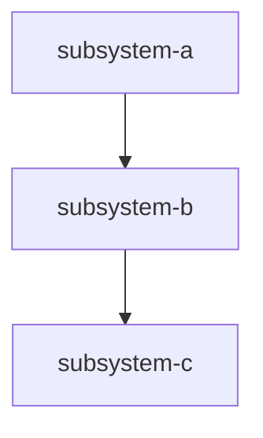

# g-subsystems

**Files Owned**: `.galdr/SUBSYSTEMS.md`, `.galdr/subsystems/{name}.md`

**Activate for**: "add subsystem", "update subsystem spec", "what subsystems exist", sync check for subsystem drift, before modifying any subsystem's code.

**Rule**: Read the subsystem spec BEFORE modifying subsystem code. Append to its Activity Log on task completion or bug fix.

---

## Operation: DISCOVER (used during g-setup)

Scan the project to identify subsystems:
- Top-level directories and `src/` subdirectories → candidate subsystems
- Database schema files → table groups suggest subsystems
- Config files → each config suggests a consuming subsystem
- API route files → each route group suggests a subsystem
- Docker services → each container is likely its own subsystem
- External service integrations → listed under their host subsystem

**Classify**:
- **Subsystem** — own code + state + lifecycle → top-level entry + spec file
- **Sub-feature** — shares parent's code/state → documented in parent spec (not its own entry)
- **Integration** — external adapter → listed in host subsystem spec

---

## Operation: CREATE SUBSYSTEM SPEC

Create `.galdr/subsystems/{name}.md`:

```yaml
---
name: subsystem-name
status: active | planned | deprecated
dependencies: [other-subsystem-names]
dependents: [subsystem-names-that-depend-on-this]
locations:
  code: [src/subsystem/]
  skills: [g-tasks, g-bugs]
  commands: [g-task-new]
  config: [config/subsystem.yaml]
  db_tables: [table_name]
---

# Subsystem: {name}

## Responsibility
[What this subsystem owns and does — 2-3 sentences]

## Data Flow
[How data enters and exits — inputs, outputs, events]

## Architecture Rules
- [What agents must never do when modifying this subsystem]
- [Patterns required or forbidden]

## When to Modify
[Trigger conditions that indicate work in this subsystem]

## Activity Log
| Date | Type | ID | Title | PRD |
|---|---|---|---|---|
| YYYY-MM-DD | TASK | NNN | {title} | PRD-NNN |
| YYYY-MM-DD | BUG | NNN | Fixed: {brief} | — |
```

**Add to SUBSYSTEMS.md** index and update the mermaid graph.

---

## Operation: UPDATE ACTIVITY LOG

After any task completion or bug fix:
1. Read the task/bug's `subsystems:` field
2. For each subsystem, read `.galdr/subsystems/{name}.md`
3. Append row to Activity Log table

---

## Operation: SYNC CHECK (staleness audit)

Collect all unique `subsystems:` values from task files. Compare to SUBSYSTEMS.md entries.
- In tasks but not in SUBSYSTEMS.md → add stub entry
- In SUBSYSTEMS.md but no spec file → create spec stub

---

## SUBSYSTEMS.md Structure

```markdown
# SUBSYSTEMS.md — {project_name}

## Overview
Read the spec file before modifying any subsystem.

## Taxonomy
- **Subsystem** = engineering unit with its own code, config, state, lifecycle
- **Sub-feature** = component documented within a parent subsystem's spec
- **Integration** = external adapter listed under its host subsystem

## Subsystem Index

| Subsystem | Status | Spec File | Purpose |
|---|---|---|---|
| {name} | active | `subsystems/{name}.md` | {purpose} |

## Sub-Features (in parent specs)
| Sub-Feature | Parent | What It Covers |
|---|---|---|

## Integrations (in parent specs)
| Integration | Host Subsystem | What It Connects |
|---|---|---|

## Interconnection Graph

```
